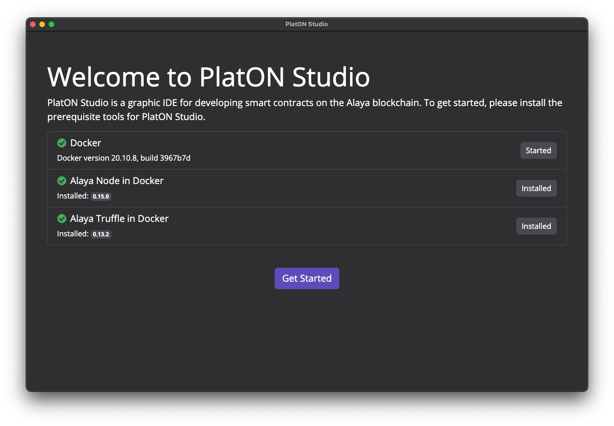
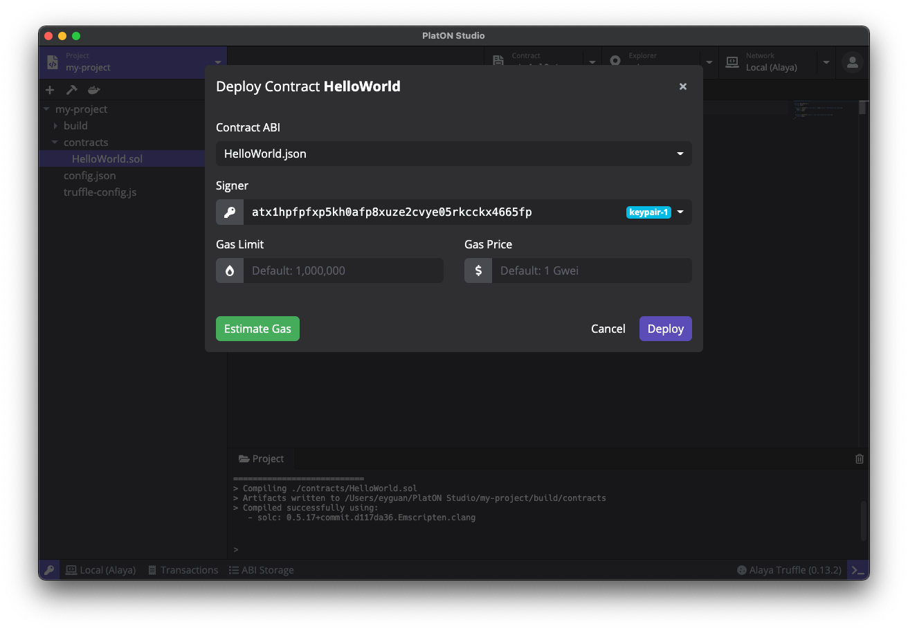

# PlatON Studio

PlatON Studio 是一个帮助开发者快速开发 [PlatON](https://www.platon.network/) 智能合约的集成化开发环境。

## 安装

### 下载

PlatON Studio 安装包可以下载 [macOS](https://app.obsidians.io/platon/mac) / [Linux](https://app.obsidians.io/platon/linux) / [Windows](https://app.obsidians.io/platon/win) 版本。目前 PlatON Studio 支持 macOS, Linux 和 Windows 系统，请根据系统下载对应的版本 (macOS 下载 .dmg 或者 .zip，Linux 下载 .AppImage, Windows 下载 .exe)。

### 安装

- **macOS**: 双击打开 `PlatON-Studio-x.x.x.dmg` 并将 `PlatON Studio` 拖动到应用文件夹内。
- **Linux**: 双击打开 `PlatON-Studio-x.x.x.AppImage`, 选择 *Properties* => *Permissions* => *Execute*, 将 *Allow executing file as progrom* 选项打勾。关闭属性设置窗口并双击打开应用（不同的 Linux 发行版可能会有不同的安装方式）。
- **Windows**:  双击打开 `PlatON-Studio-x.x.x.exe`。

## 功能预览

PlatON Studio 已经支持[Alaya](https://alaya.network) 网络上的合约开发，部署和调试。[Alaya](https://alaya.network) 既是PlatON的先行试验区，同时Alaya又是独立的。Alaya主要面向交易和事务，PlatON主要面向数据。PlatON定位于全球领导性的隐私AI网络，聚焦于服务数据资产+模型算法+算力交易平台；是从认知到决策阶段数据要素资产化的完整生态；Alaya定位于全球领先的金融公链，凭借我们的技术和运营优势，来重新构造区块链的DeFi应用体系。

PlatON Studio 将于近期更新支持PlatON网络上的合约开发，敬请期待。

### 准备工作

在正确安装 PlatON Studio 并初次启动时，你将看到一个欢迎页面，这里有 PlatON Studio 正常运行所需要的依赖，包括了 Docker，Alaya Node 以及 Alaya Truffle

  

- PlatON Studio 使用 [**Docker**](https://www.docker.com/) 来启动 PlatON 节点和进行项目编译。如果你之前没有安装过 Docker，可以点击 *Install Docker* 按钮访问 Docker 官方网站并进行下载安装。
- **Alaya Node in Docker** Alaya 节点镜像，PlatON Studio 使用这个镜像来运行 Alaya 节点以及项目编译
- **Alaya Truffle in Docker** 是 Alaya 版本的 Truffle。PlatON Studio 使用这个工具包进行项目的创建和编译。

当所有依赖都正确安装并运行后，灰色的 *Skip* 按钮将会变成绿色的 *Get Started* 按钮。点击这个按钮进入 PlatON Studio 的主界面。
 
### 创建密钥对

进入主界面后，我们需要首先创建一些密钥对。在 PlatON Studio 的任意界面，点击应用左下⻆的钥匙图标，打开密钥管理器。

  

你可以在密钥管理器中创建、导入并管理密钥对。在创建和编辑密钥对的时候，你可以为该密钥对设置别名，方便在后续的使用中进行识别。密钥管理器除了对密钥对进行储存管理外，还将为创世区块提供创世地址。创建新的 PlatON 节点实例时，会使用密钥管理器里所有的地址作为创世地址。

**在继续之前，请先在密钥管理器中创建一些密钥对，作为接下来创建节点实例的创世地址。**

### 启动节点

点击顶部的 *Network* 标签，主页面将切换为网络管理器。在网络管理器中，我们可以进行 PlatON 节点版本和节点实例的管理，包括下载、删除 PlatON 节点版本，根据不同版本创建、删除和运行节点实例。

点击主页面中右上角的 *New Instance* 按钮打开创建新实例的弹窗，填写实例名称和选择合适的版本，点击 *Create* 按钮完成节点实例的创建。创建节点实例时间比较长 可能需要等待 1 - 2 分钟。

  

节点实例创建完成后，实例列表将显示刚刚创建好的实例，点击实例的绿色 *Start* 按钮启动 PlatON 节点。启动完成后，你可以在下方的日志查看器中检查节点运行日志。

  

### 创建智能合约项目

点击顶部的 *Project* 标签，主页面将切换至项目管理器。点击页面右上角的 *New* 按钮打开创建项目弹窗，输入项目名称并选择合适的模版，PlatON Studio 目前提供了多个模版：

- `Hello World` (Solidity)
- `Crowd Funding` (Solidity)
- `Hello World` (WASM)

  

项目创建完成后，主页面将切换至项目编辑器。项目编辑器由几个部分组成，包括了文件浏览器，代码编辑器，工具栏，日志查看器等多个开发常用模块。

### 编译智能合约项目

点击工具栏的编译按钮（锤子形状），PlatON Studio 将进行项目的编译*，你可以通过下方的日志查看器来查看编译结果。编译后将在项目目录下的 `build` 文件夹中生成 json 文件。

  

***编译过程中需要下载 Solc 等编译工具，在国内网路环境下可能需要使用网络代理才能完成编译**

### 部署智能合约项目

点击工具栏的部署按钮（船形状），部署参数窗口将被打开，在这里可以输入部署合约的名称、构造函数的参数、交易签名者和合约账号。

  

点击 *Deploy* 按钮 A la ya Studio 将进行项目部署，部署结果将会弹窗显示。

  

### 调用合约

成功部署智能合约后，点击弹窗中点击 *contract* 旁的地址，主页面将切换至合约浏览器，PlatON Studio 将自动打开刚才部署完成的智能合约。

合约浏览器页面主要分为两个部分：

- 左边为合约的调用方法，点击左半部分的左上角蓝色按钮弹出的下拉框显示当前合约所定义的方法，点击方法名称可以切换调用的方法。
- 右边为合约的数据读取，点击右半部分的左上角蓝色按钮弹出的下拉框显示当前合约的数据表，点击表名称可以切换查看不同表中的数据。

PlatON Studio 会自动读取合约 ABI 中的 functions，并为每个 function 生成参数表单。用户可以简单的选择要调用的 function，输入参数，选择签名者（需要为 keypair manager 中存在的地址；读操作不需选择），并点击运行按钮进行合约调用。调用结果（成功或失败）将显示在下方的 result 栏中。

  

接下来我们调用部署好的合约 `HelloWorld`。选择 *setName* 方法，在 *Parameters* 下填入 *_name*，如 填入`Hello Alaya`。点击 *estimate* 按钮，PlatON Studio 会自动估算这笔交易所需要的手续费。PlatON Studio 会自动选择 *Authorization* 地址，你也可以根据需要选择不同的地址。点击点击上方的执行按钮开始调用 *setName* 方法并发送交易。

在右边选择 *getName* 方法，点击执行按钮便可以在下方 *Result* 中看到刚刚设置的 `Hello Alaya` 了。

  

