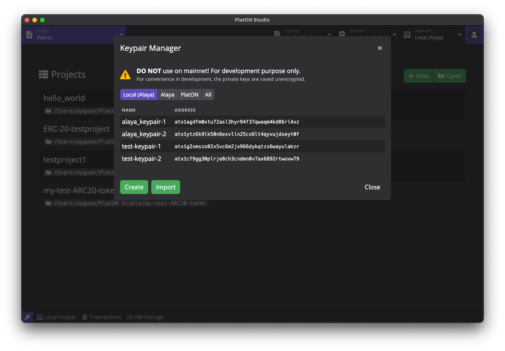
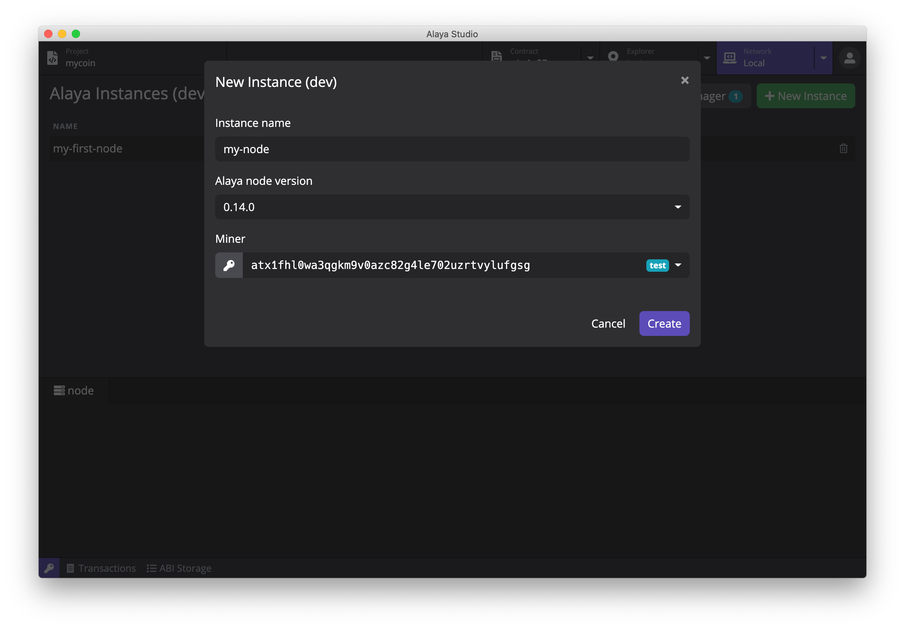

# Alaya Studio

Alaya Studio 是一个帮助开发者快速开发 [PlatON](https://www.platon.network/) 智能合约的集成化开发环境。

## 安装

### 下载

Alaya Studio 安装包可以下载 [macOS](https://platon-assets-1303090311.cos.ap-beijing.myqcloud.com/latest/AlayaStudio-0.1.0.dmg) / [Linux](https://platon-assets-1303090311.cos.ap-beijing.myqcloud.com/latest/AlayaStudio-0.1.0.AppImage) / [Windows](https://platon-assets-1303090311.cos.ap-beijing.myqcloud.com/latest/AlayaStudio-0.1.0.exe) 版本。目前 Alaya Studio 支持 macOS, Linux 和 Windows 系统，请根据系统下载对应的版本 (macOS 下载 .dmg 或者 .zip，Linux 下载 .AppImage, Windows 下载 .exe)。

### 安装

- **macOS**: 双击打开 `AlayaStudio-x.x.x.dmg` 并将 `Alaya Studio` 拖动到应用文件夹内。
- **Linux**: 双击打开 `AlayaStudio-x.x.x.AppImage`, 选择 *Properties* => *Permissions* => *Execute*, 将 *Allow executing file as progrom* 选项打勾。关闭属性设置窗口并双击打开应用（不同的 Linux 发行版可能会有不同的安装方式）。
- **Windows**:  双击打开 `AlayaStudio-x.x.x.exe`。

## 功能预览

### 准备工作

在正确安装 Alaya Studio 并初次启动时，你将看到一个欢迎页面，这里有 Alaya Studio 正常运行所需要的依赖，包括了 Docker，Alaya Node 以及 Alaya Truffle

  

- Alaya Studio 使用 [**Docker**](https://www.docker.com/) 来启动 Alaya 节点和进行项目编译。如果你之前没有安装过 Docker，可以点击 *Install Docker* 按钮访问 Docker 官方网站并进行下载安装。
- **Alaya Node in Docker** Alaya 节点镜像，Alaya Studio 使用这个镜像来运行 Alaya 节点以及项目编译
- **Alaya Truffle in Docker** 是 Alaya 版本的 Truffle。Alaya Studio 使用这个工具包进行项目的创建和编译。

当所有依赖都正确安装并运行后，灰色的 *Skip* 按钮将会变成绿色的 *Get Started* 按钮。点击这个按钮进入 Alaya Studio 的主界面。

### 创建密钥对

进入主界面后，我们需要首先创建一些密钥对。在 Alaya Studio 的任意界面，点击应用左下⻆的钥匙图标，打开密钥管理器。

  

你可以在密钥管理器中创建、导入并管理密钥对。在创建和编辑密钥对的时候，你可以为该密钥对设置别名，方便在后续的使用中进行识别。密钥管理器除了对密钥对进行储存管理外，还将为创世区块提供创世地址。创建新的 Alaya 节点实例时，会使用密钥管理器里所有的地址作为创世地址。

**在继续之前，请先在密钥管理器中创建一些密钥对，作为接下来创建节点实例的创世地址。**

### 启动节点

点击顶部的 *Network* 标签，主页面将切换为网络管理器。在网络管理器中，我们可以进行 Alaya 节点版本和节点实例的管理，包括下载、删除 Alaya 节点版本，根据不同版本创建、删除和运行节点实例。

点击主页面中右上角的 *New Instance* 按钮打开创建新实例的弹窗，填写实例名称和选择合适的版本，点击 *Create* 按钮完成节点实例的创建。

  

节点实例创建完成后，实例列表将显示刚刚创建好的实例，点击实例的绿色 *Start* 按钮启动 Alaya 节点。启动完成后，你可以在下方的日志查看器中检查节点运行日志。

  

### 创建智能合约项目

点击顶部的 *Project* 标签，主页面将切换至项目管理器。点击页面右上角的 *New* 按钮打开创建项目弹窗，输入项目名称并选择合适的模版，Alaya Studio 目前提供了四个模版：

- `Hello World` (Solidity)
- `Crowd Funding`
- `Hello World` (WASM)
- `Mtacoin`

  

项目创建完成后，主页面将切换至项目编辑器。项目编辑器由几个部分组成，包括了文件浏览器，代码编辑器，工具栏，日志查看器等多个开发常用模块。

### 编译智能合约项目

点击工具栏的编译按钮（锤子形状），Alaya Studio 将进行项目的编译*，你可以通过下方的日志查看器来查看编译结果。编译后将在项目目录下的 `build` 文件夹中生成 json 文件。

  

***编译过程中需要下载 Solc 等编译工具，在国内网路环境下需要翻墙才能完成编译**
