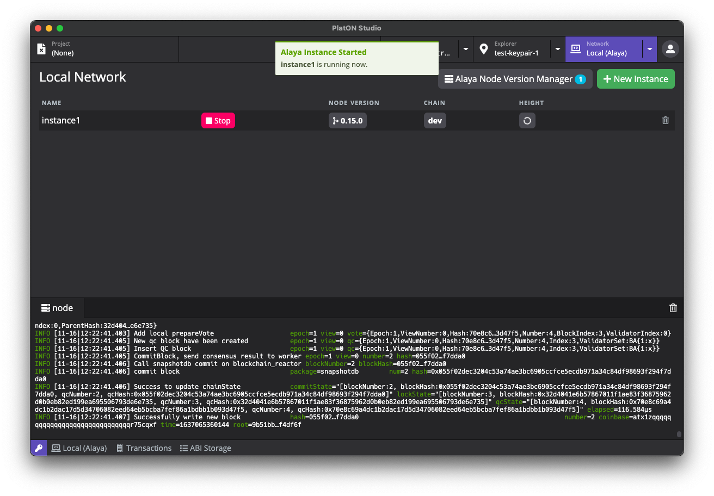
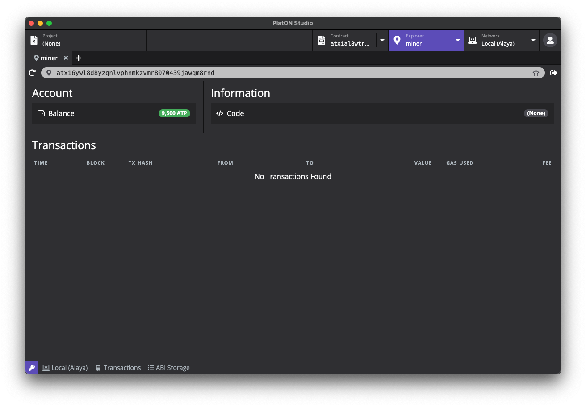
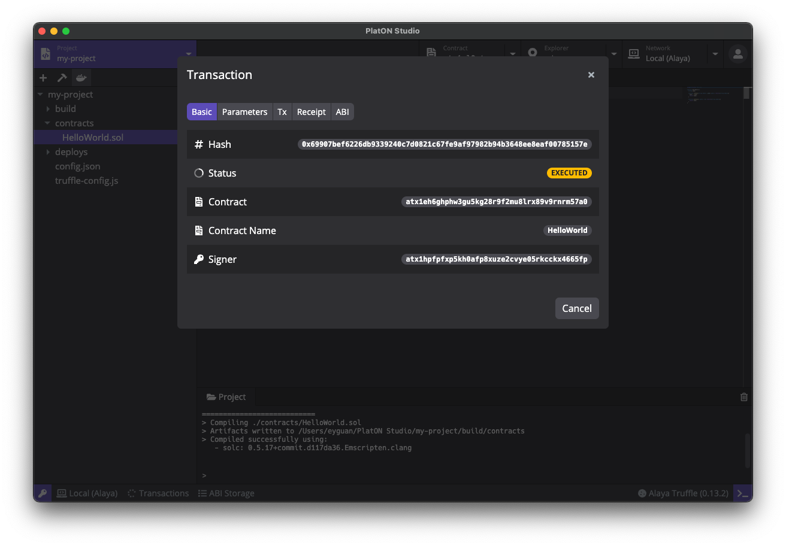
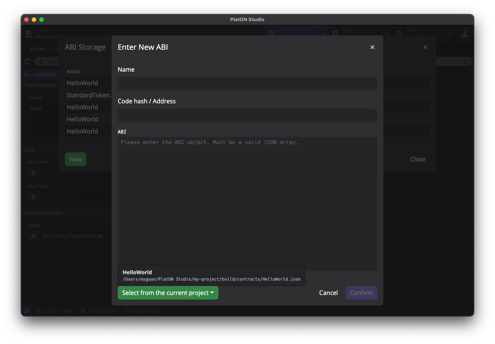
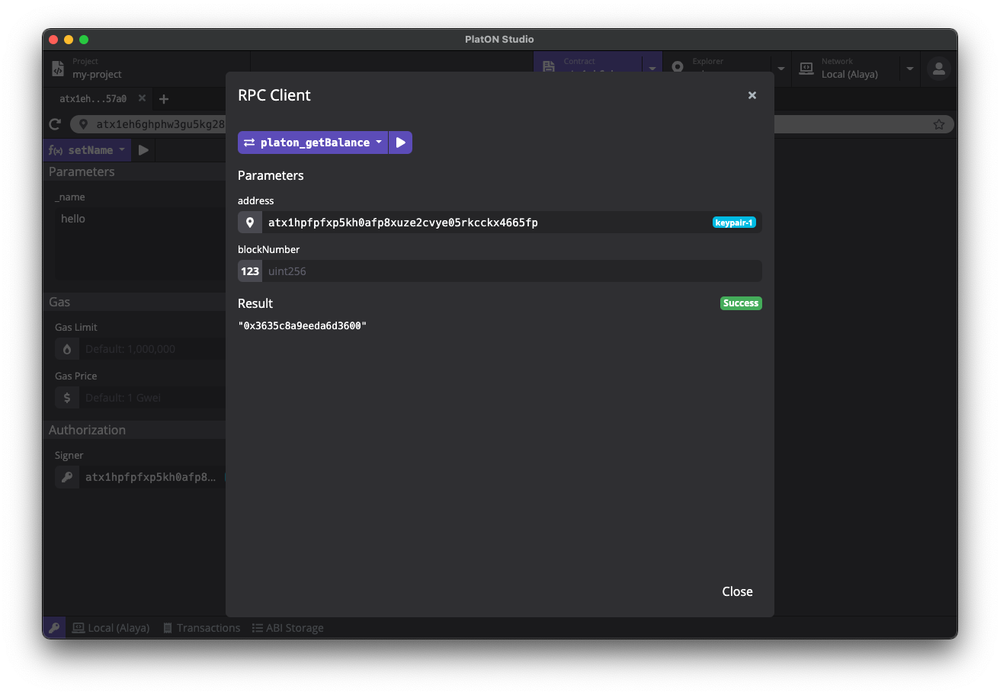

# PlatON Studio

PlatON Studio 是一个帮助开发者快速开发 [PlatON](https://platon.network/) 智能合约的集成化开发环境，同时支持 [Alaya 先行网络](https://alaya.network) 和 [PlatON 主网络](https://platon.network) 上的合约开发、部署和调试。

### 下载

PlatON Studio 安装包可以在 [Github Releases](https://github.com/ObsidianLabs/PlatON-Studio/releases) 进行下载。目前 PlatON Studio 支持 macOS, Linux 和 Windows 系统，请根据系统下载对应的版本 (macOS 下载 `.dmg` 或者 `.zip`，Linux 下载 `.AppImage`，Windows 下载 `.exe`)，或直接点击一下链接下载对应操作系统的安装包：

- macOS: https://app.obsidians.io/platon/mac
- Linux: https://app.obsidians.io/platon/linux
- Windows: https://app.obsidians.io/platon/win

### 安装

- **macOS**: 双击打开 `PlatON-Studio-x.x.x.dmg` 并将 `PlatON Studio` 拖动到应用文件夹内。
- **Linux**: 双击打开 `PlatON-Studio-x.x.x.AppImage`, 选择 *Properties* => *Permissions* => *Execute*, 将 *Allow executing file as progrom* 选项打勾。关闭属性设置窗口并双击打开应用（不同的 Linux 发行版可能会有不同的安装方式）。
- **Windows**:  双击打开 `PlatON-Studio-x.x.x.exe`。

## 功能预览

### 准备工作

在正确安装 PlatON Studio 并初次启动时，你将看到一个欢迎页面，这里有 PlatON Studio 正常运行所需要的依赖，包括了 Docker，Alaya Node 以及 Alaya Truffle

  

- PlatON Studio 使用 [**Docker**](https://www.docker.com/) 来启动 PlatON 节点和进行项目编译。如果你之前没有安装过 Docker，可以点击 *Install Docker* 按钮访问 Docker 官方网站并进行下载安装；
- **Alaya Node in Docker** 是 Alaya 节点镜像，PlatON Studio 使用这个镜像来运行 Alaya 节点；
- **Alaya Truffle in Docker** 是 Alaya 版本的 Truffle。PlatON Studio 使用这个工具包进行项目的创建和编译。

当所有依赖都正确安装并运行后，灰色的 *Skip* 按钮将会变成蓝色的 *Get Started* 按钮。点击这个按钮进入 PlatON Studio 的主界面。

### 密钥管理器

进入主界面后，我们需要首先创建一些密钥对。在 PlatON Studio 的任意界面，点击应用左下⻆的钥匙图标，打开密钥管理器。

  

你可以在密钥管理器中创建、导入并管理密钥对。PlatON Studio 支持对 PlatON、Alaya、和本地开发网络，分别储存不同地址格式的秘钥对（分别以`lat`、`atp`、`atx`作为地址开头）。在创建和导入密钥对的时候，可以选择使用私钥或助记词两种形式创建。你还可以为该密钥对设置别名，方便在后续的使用中进行识别。

密钥管理器除了对密钥对进行储存管理外，还将为创世区块提供创世地址。创建新的本地节点实例时，会使用密钥管理器里所有的地址作为创世地址。*在继续之前，请先在密钥管理器中创建一些密钥对，作为接下来创建节点实例的创世地址。*

### 本地开发节点

点击顶部的 *Network* 标签，主页面将切换为网络管理器。在网络管理器中，我们可以进行本地节点版本和节点实例的管理，包括下载、删除本地节点版本，根据不同版本创建、删除和运行节点实例。

点击主页面中右上角的 *New Instance* 按钮打开创建新实例的弹窗，填写实例名称和选择合适的版本，点击 *Create* 按钮完成节点实例的创建。创建节点实例时间比较长 可能需要等待十几秒钟。

  

节点实例创建完成后，实例列表将显示刚刚创建好的实例，点击实例的绿色 *Start* 按钮启动本地节点。启动完成后，你可以在下方的日志查看器中检查节点运行日志。

  

### 远程网络

另外，PlatON Studio 中已经内置了 PlatON 主网、测试网，以及 Alaya 主网和测试网的连接。点击 *Network* 标签旁的下拉箭头，可以直接选择希望使用的网络，一键进行切换。

### 区块浏览器

成功启动本地节点或连接到远程网络后，点击顶部的 *Explorer* 标签打开区块浏览器。在 *Explorer* 标签旁的下拉菜单中，可以直接选择密钥管理器中保存的地址。或者，也可以在输入框中输入或粘贴希望访问的地址。点击回车后，我们便可以看到对应地址的余额、交易记录等信息。

  

在地址栏右边，是常用的工具按钮。例如，点击转账按钮后可以发起一笔转账交易（当然，需要你拥有当前地址的私钥）。如果当前连接的是 Alaya 测试网或 PlatON 测试网，地址栏右边还会有 Faucet 按钮，点击后可以打开申请测试 token 的界面。

### 创建智能合约项目

点击顶部的 *Project* 标签，切换至合约项目界面。点击页面右上角的 *New* 按钮打开创建项目弹窗，输入项目名称并选择合适的模版，PlatON Studio 目前提供了多个模版：

- [Hello World (Solidity)](https://devdocs.platon.network/docs/zh-CN/Solidity_Dev_Manual/#%E5%88%9B%E5%BB%BAhelloworld%E5%90%88%E7%BA%A6)：基于 Solidity 的一个简单的智能合约；
- [Crowd Funding (Solidity)](https://devdocs.platon.network/docs/zh-CN/Solidity_Dev_Manual#%E4%BC%97%E7%AD%B9%E5%90%88%E7%BA%A6)：基于 Solidity 的众筹智能合约；
- [Hello World (WASM)](https://devdocs.platon.network/docs/zh-CN/Wasm_Dev_Manual#%E5%88%9B%E5%BB%BAhelloworld%E5%90%88%E7%BA%A6)：基于 C++ 的一个简单的智能合约。

  

项目创建完成后，PlatON Studio 将自动在项目编辑器中打开新创建的项目。项目编辑器由几个部分组成，包括了文件浏览器，代码编辑器，工具栏，终端等多个模块。

### 编译智能合约

点击工具栏的编译按钮（锤子形状），PlatON Studio 将进行项目的编译，你可以通过下方的终端来查看编译结果。编译后将在项目目录下的 `build/contracts` 文件夹中生成编译后的 JSON 文件，具体的数据格式可参见 [solc 文档](https://docs.soliditylang.org/en/latest/using-the-compiler.html#output-description)。

编译过程中需要下载 Solc，在国内网路环境下可能需要使用网络代理才能完成编译。

  

### 部署智能合约

点击工具栏的部署按钮（船形状），部署参数窗口将被打开，在这里可以选择要部署的合约，输入构造函数的参数，并选择部署交易的签名者。

  

部署之前，可以点击 *Estimate* 按钮，估算部署交易所需的手续费（Gas 和 Gas Price），然后再点击 *Deploy* 按钮完成合约部署。有时候预估的 Gas 是不够的，如果部署时出现 Gas 不够的错误，可以提高 Gas 值后重试。

合约部署成功后，PlatON Studio 将弹出交易详情弹窗，显示合约部署的结果，包括交易哈希、已部署合约的地址、参数、部署交易、Receipt、ABI 等等相关数据。

  

同时，你也可以点击 PlatON Studio 底部栏的 *Transactions*，看到刚刚发送的部署交易，查询该交易的执行状态（pending、mined 或 executed），或点击该交易再次打开交易详情弹窗。

### 合约浏览器

成功部署智能合约后，点击交易详情弹窗中 *Contract* 旁的地址，PlatON Studio 将切换至合约浏览器，并自动打开刚部署完成的智能合约。你也可以点击顶部的 *Contract* 标签切换至合约浏览器，在地址栏中输入希望打开的合约地址。PlatON Studio 支持同时打开多个合约，方便进行多合约的调试工作。

合约浏览器页面主要分为三个部分：

- 左边栏用于调用合约的写入方法：点击蓝色下拉框，选择希望调用该合约的写入方法；
- 中间栏用于进行合约的数据读取：点击蓝色下拉框，选择希望查询该合约的读取方法；
- 右边栏用于进行合约的事件查询，点击蓝色下拉框，选择希望查询该合约的事件。

PlatON Studio 在部署合约后将自动保存合约 ABI，并在读取合约时读取 ABI 数据，用于生成上面的写入方法、读取方法、事件查询，和它们各自的参数表单（关于更多 ABI 的使用参见 [ABI Storage](#abi-storage)）。

  

接下来我们将使用刚刚部署的 `HelloWorld` 合约，演示如何使用写入方法、读取方法、和事件查询。

在左边栏，选择 *setName* 方法，在 *Parameters* 下填入 *_name* 参数的值，例如 `Hello Alaya`。点击 *estimate* 按钮，PlatON Studio 会自动估算这笔交易所需要的手续费。在 *Authorization* 中选择为交易签名的地址后，点击上方的执行按钮，即可发送调用写入方法的交易。交易发送后也将同步到底部栏的 `Transactions` 列表中，方便查询交易执行状态，或之后查询交易详情数据（例如调用合约的地址、方法、参数、及交易等数据）。

PlatON Studio 的参数输入表单，支持了 Solidity 的各种参数格式，包括 (u)int, address, string, bool, bytes, 数组，结构体等。

在中间栏，在选择 *getName* 方法，点击执行按钮便可执行读取方法，并在下方 *Result* 中看到查询结果为刚刚设置的 `Hello Alaya`。

  

该合约没有设置事件（Events）。如果操作的合约有定义事件，在右侧栏中可以选择希望查询的事件，指定查询范围（默认最近10000个）后进行查询。结果将以表格的形式呈现。

#### ABI storage

在使用合约浏览器时，PlatON Studio 需要基于合约 ABI 生成各读写方法和查询事件的界面，底部栏中的 ABI Storage 就是保存这些合约 ABI 的地方。在合约部署成功后，PlatON Studio 将自动保存合约的 ABI。有些情况，如果需要调用其它合约（例如线上合约），就需要将合约的 ABI 添加到 ABI Storage 中。使用 ABI Storage 中的 New 按钮即可完成该操作。

  

为方便使用，PlatON Studio 也会自动读取当前项目中，已编译过合约的 ABI，从 Enter New ABI 弹窗左下角的按钮中即可选择。

### RPC Client

PlatON Studio 还提供了直接从底层调用 PlatON/Alaya 节点 RPC 接口的功能。点击底部栏的网络按钮，在弹出菜单中选择并打开 RPC Client 后，可以看到 PlatON/Alaya 节点的全部 RPC 接口。对每个 RPC 接口，PlatON Studio 也将生成对应的参数表格，填写数据后点击运行按钮，即可完成调用并查看返回数据。

  

